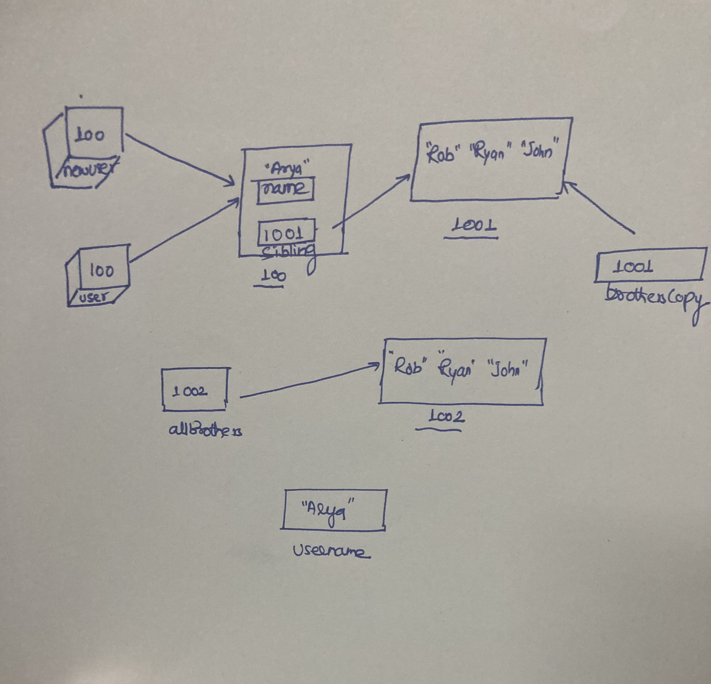

```js
let user = {
  name: 'Arya',
  sibling: ['Robb', 'Ryan', 'John'],
};
let allBrothers = ['Robb', 'Ryan', 'John'];
let brothersCopy = user.sibling;
let username = user.name;
let newUser = user;
```

1. Memory representation

- Create the memory representation of the above snippet on notebook.
- Take a photo/screenshot and add it to the folder `code`

 

2. Answer the following with reason:

- `user == newUser;` // true, because both are pointing to the same object in memory
- `user === newUser;`// true, because both are object references pointing to the same object
- `user.name === newUser.name;`// true, the value and type of name property is same, as object is same
- `user.name == newUser.name;`//true
- `user.sibling == newUser.sibling;`//true, both are pointing to the same array object
- `user.sibling === newUser.sibling;`//true, same type array and same object 
- `user.sibling == allBrothers;`// false , as  they are different objects so references are not same
- `user.sibling === allBrothers;`//false , as they are different objects
- `brothersCopy === allBrothers;`//false,as they point to different memory locations
- `brothersCopy == allBrothers;`//false, as they point to different memory locations
- `brothersCopy == user.sibling;`//true, both point point to same location
- `brothersCopy === user.sibling;`//true, both point point to same location
- `brothersCopy[0] === user.sibling[0];`//true, both are pointing to same location and 1st object
- `brothersCopy[1] === user.sibling[1];`//true, both are pointing to same location and 2nd object
- `user.sibling[1] === newUser.sibling[1];`//true, both are pointing to same location and 2nd object
