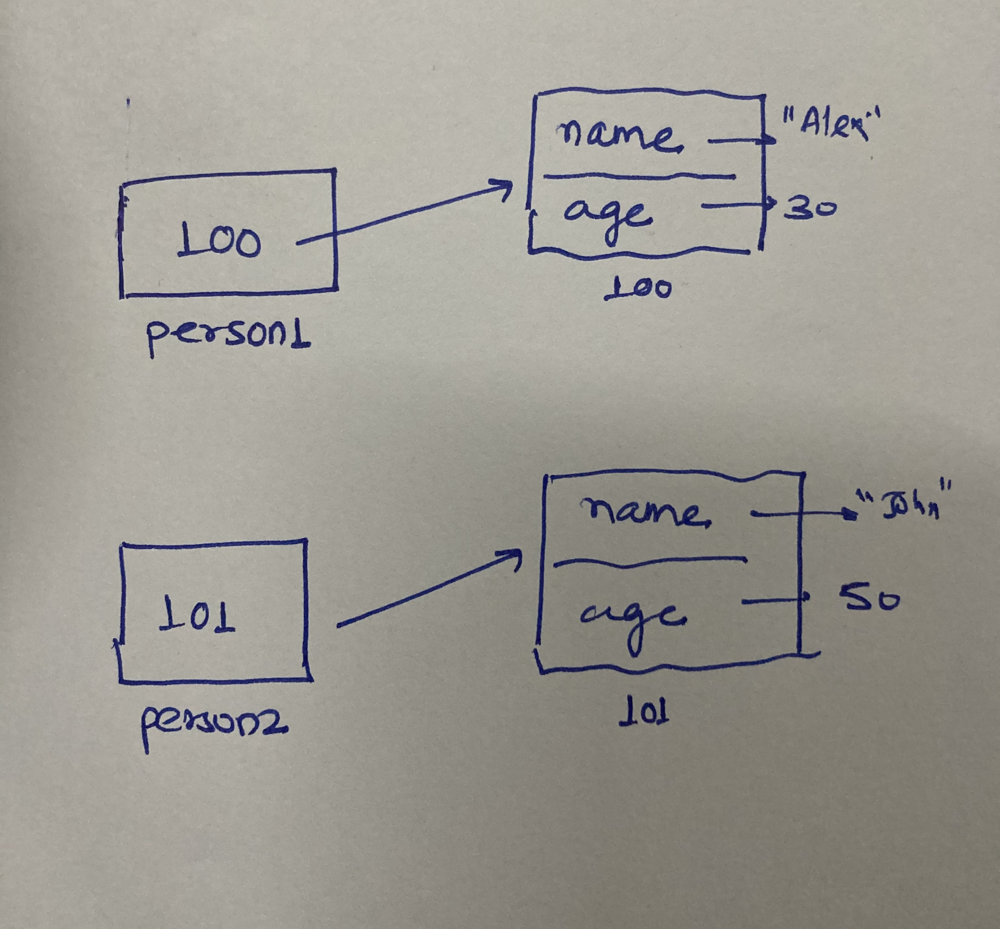

1. What will be the output and explain the reason.

```js
let obj = { name: 'Arya' };
obj = { surname: 'Stark' };
let newObj = { name: 'Arya' };
let user = obj;
let arr = ['Hi'];
let arr2 = arr;
```

Answer the following with reason after going through the above code:

- `[10] === [10]`//false, because both have different memory locations
- What is the value of obj? // { surname: 'Stark' }
- `obj == newObj`// false, they refer to different memory locations
- `obj === newObj`// false, they refer to different memory locations
- `user === newObj`//false, they refer to different memory locations
- `user == newObj`//false, they refer to different memory locations
- `user == obj`// true,if obj is not declared twice then they both refer to same location
- `arr == arr2`// true , both refer to same location of array object
- `arr === arr2`// true, both refer to sam elocation of array object

2. What's will be the value of `person1` and `person2` ? Explain with reason. Draw the memory representation diagram.



```js
function personDetails(person) {
  person.age = 25;
  person = { name: 'John', age: 50 };
  return person;
}
var person1 = { name: 'Alex', age: 30 };
var person2 = personDetails(person1);
console.log(person1);//{ name: 'Alex', age: 30 }
console.log(person2);//{ name: 'John', age: 50 }
//person1 is an object which is different form person2 which ges new address when personDetails function is called and its reference is passed, then it is defined through person object literal.
```

3. What will be the output of the below code:

```js
var brothers = ['Bran', 'John'];
var user = {
  name: 'Sansa',
};
user.brothers = brothers;
brothers.push('Robb');
console.log(user.brothers === brothers); //true
console.log(user.brothers.length === brothers.length); //true
```
